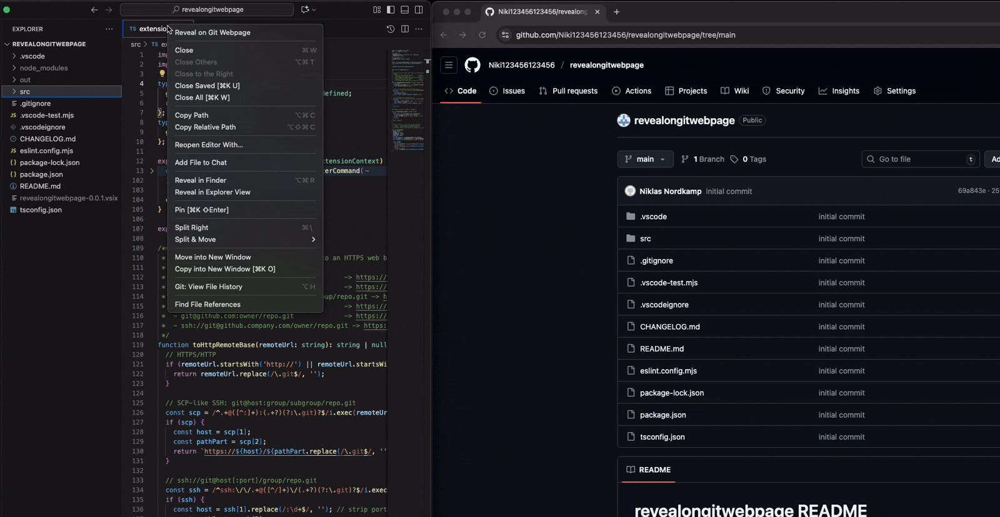

# reveal on git webpage

Reveal the current file on your Git hosting webpage (GitHub, GitLab, etc) directly from VS Code.

## Usage

1. Right-click a file in the Explorer, or open a file in the editor.
2. Run the command **Reveal on Git Webpage** from the context menu or Command Palette.
3. The file will open in your browser at the correct location on your Git remote.

## Supported Git Hosts

- GitHub (including GitHub Enterprise)
- GitLab (including self-hosted)
- Other forges (falls back to GitHub-style URLs)

## Features

- Reveals the currently open file (or selected file in the Explorer) in your default browser, at the corresponding location on your Git remote (supports GitHub, GitLab, and similar forges).
- Supports both branch and commit views, and will include the current caret line if invoked from the editor.
- Automatically detects the correct remote (prefers `origin`), branch, and file path.
- Handles various remote URL formats (HTTPS, SSH, SCP-like, etc).
- Works with multi-root and subfolder repositories.

## How It Works

1. **Detects the file and repository:**
	- Uses the VS Code Git extension API to find the repository and file relative path.
2. **Finds the current branch or commit:**
	- Uses the current branch name, or falls back to the short commit hash if detached.
3. **Chooses the remote:**
	- Prefers `origin`, but will use the first available remote if not found.
4. **Builds the correct URL:**
	- Converts SSH/HTTPS remote URLs to a web URL, strips `.git`, and builds a blob URL for the file and line.
5. **Opens in your browser:**
	- Launches the constructed URL in your default browser.

